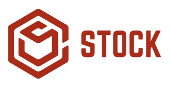

<p align="center">

</p>

**Número da Lista**: 12<br>
**Código da Disciplina**: FGA0208-T01<br>

Toda a documentação está exposta de forma organizada em nossa GH Pages: https://unbarqdsw.github.io/2020.1_G12_Stock/#/


## Alunos

| Matrícula  | Aluno    |GitHub                         |
| ---------- | --------------------------------- | - |
| 17/0010341 | Gabriel Davi Silva Pereira        | [@GabrielDVpereira](https://github.com/GabrielDVpereira)
| 17/0111288 | Micaella Lorraine Gouveia de Lima | [@micaellagouveia](https://github.com/micaellagouveia)
| 17/0062635 | Pedro Igor Oliveira Silva         | [@pedroeagle](https://github.com/pedroeagle)
| 17/0114333 | Sofia Costa Patrocínio            | [@sofiapatrocinio](https://github.com/sofiapatrocinio)

## Sobre

Sistema para cadastro e consulta de estoque. Plataforma web para cadastro e listagem de produtos, assim como exportação de planilhas e plotagem de gráficos. Versão mobile para consulta rápida de produtos e para atualização mais ágil de estoque.

## Instalação

Pré-requisitos: 
* É necessário ter o [Docker](https://www.docker.com/) instalado.
* É necessário ter o [docker-compose](https://docs.docker.com/compose/) instalado.

Instalação: 
Depende de do seu sistema operacional.
* Docker: Siga as instruções do site oficial : [https://www.docker.com/get-started](https://www.docker.com/get-started)
* Docker-compose: Siga as instruções do site oficial: [https://docs.docker.com/compose/install/](https://docs.docker.com/compose/install/)


## Uso

Logo depois, para executar o container da aplicação pela primeira vez, execute o comando:

```$ sudo docker-compose up --build```

Para executar novamente, execute o comando:

```$ sudo docker-compose up```

O projeto será disponibilizado em  ```localhost:8000```.
## Contribuição
Para contribuir com esse repositório:
1. Crie um issue detalhando o que será feito.
2. Crie uma branch com nome significativo com base na branch ```devel```. A branch criada deve seguir o padrão: ```XX-nome-da-issue```, sendo o XX o número da issue.
3. Faça suas alterações na branch criada.
4. Rode a folha de estilo para verificar se está de acordo com os padrões do repositório.

Para rodar a folha de estilo, execute o comando:

```$ sudo docker exec -it 20201_g12_stock_backend_app_1 yarn lint```

Para reparar os erros encontrados na folha de estilo, execute o comando:


```$ sudo docker exec -it 20201_g12_stock_backend_app_1 yarn lint --fix```

5. Abra um pull request detalhado com tudo o que foi feito, seguindo o template disponibilizado.

### Endpoints

Para ver quais os endpoints desssa aplicação acesse a rota principal ```/endpoints```.

Requisições para testes estão disponíveis no **diretório** ```./insomnia```. Basta importar o arquivo mais atual no [Insomnia](https://github.com/Kong/insomnia)
e utilizar as rotas criadas :)

### Migrations
Caso precise atualizar as migrations, desfaça as migrations com o seguinte comando:

```sudo docker exec -it nomeContainer yarn sequelize db:migrate:undo:all```

Para rodar as migrations, execute o comando:

```sudo docker exec -it nomeContainer yarn sequelize db:migrate```

Para rodar as seeds e popular o banco de dados, execute o comando:

```sudo docker exec -it nomeContainer yarn sequelize db:seed:all```

Para descobrir o nome do container, execute o comando: ```sudo docker ps -a```

**Nome default do container**: 20201g12stockbackend_app_1
